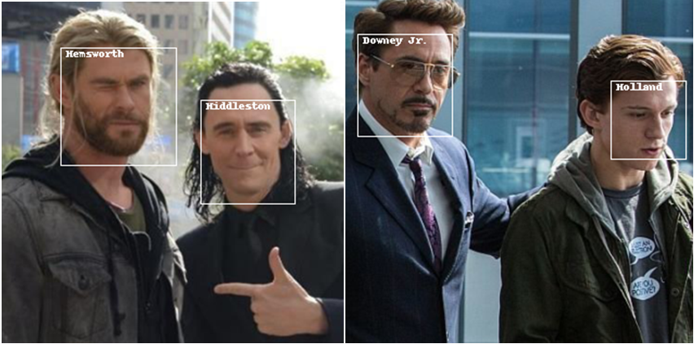

# Joint detection-identification with convolutional neural networks

This repo contains the code for my bachelor thesis on face detection and recognition.
It explores the ways of speeding up deep face recognition systems by switching from the traditional pipeline - detection -> alignment -> feature extraction -> classification - to oneshot classification-regression framework.



## Requrements

* `Python >= 3.6`
* `numpy`
* `PyTorch >= 1.0`
* `dlib`

## Get started
1. Download [FEI Face Database](https://fei.edu.br/~cet/facedatabase.html), [Caltech Faces 1999 dataset](www.vision.caltech.edu/Image_Datasets/faces/faces.tar), [Georgia Tech face database](http://www.anefian.com/research/face_reco.htm).
Organize your folders like this:

```
faces
├── fei
│   └── ...
├── caltech_faces
│   └── ...
└── gt_db
    └── ...
```

*I actually added some photos from google for 10 more subjects, which i will provide shortly.*

2. Run `preprocess.py`. After some time it will generate labels (bbox coordinates and class labels) for your data. *May produce errors since i didn't quite tested it.*

3. Run `organize_data.py`. It will downscale images (to 320px by default) and split them into trainset and testset.

4. Run `train.py` to train the network. If your GPU isn't strong enough you can decrease batch size.

## Network architecture


Network architecture is based on YOLO. DarkNet backbone is replaced with much more popular ResNet. Bbox attributes are separated from class probabilities and, furthermore, an additional layer for face embeddings added. This will help implemend things like ArcFace or Triplet loss in the future.

## Training
The training process is much similar to YOLO training. Loss function is constructed similatly.


The difference is that I use smooth L1 loss for localization loss, binary cross-entropy for confidence loss and cross-entropy for classification loss.

Training code is based on [this repo](https://github.com/eriklindernoren/PyTorch-YOLOv3).

## Results
This network wos trained and compared against traditional dlib + ResNet34 pipeline.

|              | dlib + ResNet34 | Described net |
| ------------ | --------------- | -------- |
| **Accuracy** | 97.54%  | 98.15%  |
| **Mean IoU** | 79.82%  | 78.88%  |
| **FPS**      | 6.5  | 34.5  |

This results were obtained on laptop GTX 1050 GPU, so fps can vary. Also, I don't believe dlib uses GPU acceleration, so comparison against pipelines that use MTCNN will be less impressive.
