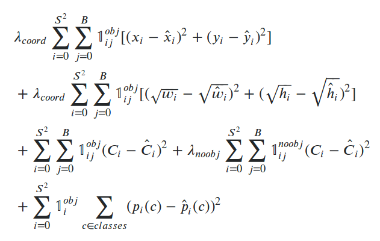

# face_detection_recognition

Этот репозиторий содержит код к дипломной работе по распознаванию лиц.

## Гипотеза
* детектирование лица можно совместить с распознаванием, 
т.е. использоват одни и те же признаки, извлеченные нейронной сетью,
и для детектирования изолражения, и для его классификации.
* подобно подходу, используемому в метрической классификации, можно
получать embedding для детектированных лиц, который в дальнейшем
можно использовать для идентификации, измеряя "похожесть" (расстояние) между двумя embedding-ами.

## Описание сети и процесса обучения
Сеть обучается тем же методом, что используется при обучении нейронной сети YOLO.

Нейронная сеть состоит из предобученного ResNet backbone, и нескольких сверточных слоев,
кодирующих признаки в матрицу 5х5. Эту матрицу можно представить как сетку 5х5, нарисованную
поверх изображения, где каждая клетка описывает какой-либо bbox с центром внутри данной клетки.

Пример можно посмотреть в [этом ноутбуке](preprocess_example.ipynb).

Каждый bbox описывается вектором длины (4 + 1 + n_classes).
4 числа описывают размеры и положение bbox, 1 число - уверенность в нахождении лица в этом bbox, 
остальные числа - распределение вероятности попадания в каждый класс.

Положение bbox - смещение его центра относительно верхнего левого угля клетки.
Размеры bbox - коэффициенты экспоненциатьного преобразования относительно одной из
предопределенных зарание anchor box.

В каждой клетке матрицы хранится 3 таких вектора, соответствующих 3 разным anchor box.
Размеры anchor box определяются зарание с помощью кластеризации ground truth bbox-ов
методом K-Means на 3 кластера.

Функция потерь - MultiBox loss, который представляет из себя сумму log loss и smooth L1 loss.

(По крайней мере мне так кажется, надo почитать [здесь](https://stats.stackexchange.com/questions/287486/yolo-loss-function-explanation) и [здесь](https://mlblr.com/includes/mlai/index.html#yolov2).)

## План экспериментов
### Экcперимент 1
Этот эксперимент призван выяснить, насколько изменится точность распознавания лиц,
если решать комбинированную задачу детектирования и распознавания.

Для этого планируется обучить нейронную сеть детектировать и классифицировать лица
на небольшом датасете из 280 субъектов, содержащем только одного человека на фотографии.

Для данного эксперимента входные изображения имеют размер 640х640.

### Экcперимент 2

Этот эксперимент призван выяснить, годится ли представление, которое сель выучивает на последнем слое,
е качестве embedding-а для лица.

### Экcперимент 3

Датасет модифицируется для обучения на случае нескольких человек на фото. Для этого несколько 
фотографий разных субъектов склеиваются в одну.

### Экcперимент 4

Модифицируется архитектура сети - добавляется декодер из нескольких deconvolution-слоев, 
тем самым увеличивая размер выходной матрицы до 19х19. Добавляются bridge connections, которые
конкатенируют ответы ранних слоев сети к поздним слоям декодера. Добавляется распознавание на разных scale-ах:
5х5, 11х11, 19х19.
