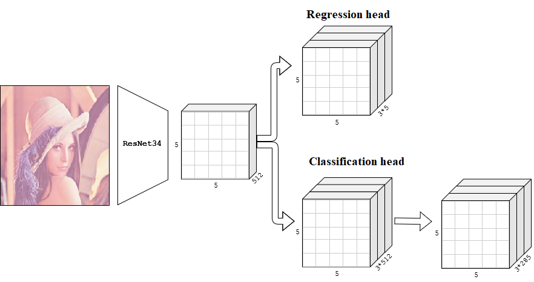

# Joint detection-identification with convolutional neural networks

Этот репозиторий содержит код к дипломной работе по распознаванию лиц.
Идея работы - перейти от пайплайна detect->align->identify к решению совмещенной задачи детектирования-идентификации, 
следуя подходу из object detection.

## Гипотеза
* детектирование лица можно совместить с идентификацией, 
т.е. использоват одни и те же признаки, извлеченные нейронной сетью,
и для детектирования изолражения, и для его классификации.
* подобно подходу, используемому в метрической классификации, можно
получать embedding для детектированных лиц, который в дальнейшем
можно использовать для идентификации, измеряя "похожесть" (расстояние) между двумя embedding-ами.

## Архитектура сети

В качестве сверточной сети для извлечения признаков используется ResNet34. 
На выхоре из avgpool слоя получается тензор признаков размера *5 x 5 x 512*.

Regression head получает из него тензор размера *5 x 5 x (num_ancors\*5)*, описывающий каждый bounding box.
4 числа описывают размеры и положение bbox-а, 1 число - уверенность в нахождении в нем лица.

Classification head получает из тензора признаков тензор размера *5 x 5 x (num_ancors\*512)*.
Это эмбеддинги лиц, находящихся в bbox-ах. Они передаются линейному классификатору (трехмерная свертка 1x1), и он возвращает
тензор размера *5 x 5 x (num_ancors\*num_classes)*, содержащий вероятности классов.

## Описание процесса обучения
Сеть обучается тем же методом, что используется при обучении нейронной сети YOLO.

Функция потерь - комбинированная, представляет собой сумму smooth L1 loss, бинарной кросс-энтропии и кросс-энтропии.
Она имеет такую же структуру, что и функция потерь из статьи YOLO:

## План экспериментов
### Экcперимент 1
Этот эксперимент призван выяснить, насколько изменится точность распознавания лиц,
если решать комбинированную задачу детектирования и распознавания.

Описанная нейронная сеть была обучена детектировать и классифицировать лица
на небольшом датасете из 285 субъектов, содержащем только одного человека на фотографии.

Обучающая выборка содержит 3277 изображений. Тестовая выборка содержит 651 изображение.
Размер изображений - 320 пикселей по меньшей стороне.

Для сравнения была обучена ResNet34 для классификации, а для детектирования использовался dlib.

Обе сети учились на случайных кропах 320x320.

Результаты:

|              | ResNet34 + dlib | Described net |
| ------------ | --------------- | -------- |
| **Accuracy**     | 97.54%  | 98.15%  |
| **Mean IoU**  | 79.82%  | 78.88%  |
| **FPS**          | 6.5  | 34.5  |

### Экcперимент 2: Transfer learning

- [ ] Переобучить только классификатор для нового датасета.

### Экcперимент 3: Metric learning

- [ ] Проверить, насколько компактными получаются ембединги для лиц не из датасета.
